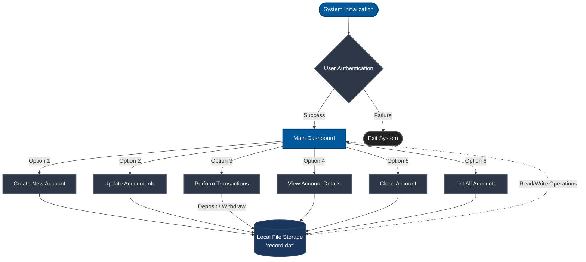

<div align="center">
  <h1>🏦 Bank Management System</h1>
  <p>A robust, console-based banking application built in C with secure file handling.</p>

  [](https://en.wikipedia.org/wiki/C_(programming_language))
  [](#)
  [](LICENSE)
</div>

<br />

## 📋 Table of Contents
- [About the Project](#-about-the-project)
- [System Architecture](#-system-architecture)
- [Core Features](#-core-features)
- [Technical Details](#-technical-details)
- [Getting Started](#-getting-started)
- [Project Structure](#-project-structure)
- [Contributing](#-contributing)

## 📖 About the Project

This project is a comprehensive **Bank Management System** developed as a 2nd-year, 3rd-semester academic project. It simulates a real-world banking environment, allowing users to perform essential banking operations through a secure and interactive command-line interface. The system emphasizes data persistence, modularity, and user-friendly navigation.

## 🏗️ System Architecture

The application follows a modular architecture, separating the user interface from business logic and data persistence layers.



## ✨ Core Features

- **Account Management**: 
  - Open new accounts with comprehensive customer details.
  - Update existing account information (address, phone number, etc.).
  - Securely close and delete accounts from the system.
- **Financial Transactions**:
  - Process deposits and withdrawals with real-time balance updates.
  - Prevent overdrafts and invalid transaction amounts.
- **Information Retrieval**:
  - Search for specific accounts using Account Number or Customer Name.
  - Generate a complete list of all active accounts in the bank.
- **Data Persistence**: 
  - Utilizes C file handling (`fread`, `fwrite`, `fopen`) to ensure all customer records and balances are permanently saved to `record.dat`.

## 💻 Technical Details

- **Language**: C Programming Language
- **Libraries Used**: 
  - `<stdio.h>`, `<stdlib.h>`, `<string.h>` for core functionality.
  - `<windows.h>` for console manipulation (color formatting, cursor positioning, and screen clearing).
- **Data Structures**: Uses `struct` to encapsulate account properties (Account Number, Name, DOB, Address, Phone, Balance).

## 🚀 Getting Started

### Prerequisites
- A C Compiler (e.g., GCC, MinGW-w64).
- Windows Operating System (required for `<windows.h>` specific UI features).

### Installation

1. **Clone the repository**
   ```bash
   git clone https://github.com/Rupeshbhardwaj002/2nd-year-3rd-sem-project.git
   cd 2nd-year-3rd-sem-project
   ```

2. **Compile the source code**
   ```bash
   gcc bank_prjct.c -o bank_management.exe
   ```

3. **Run the executable**
   ```bash
   ./bank_management.exe
   ```

## 📂 Project Structure

```text
2nd-year-3rd-sem-project/
├── bank_prjct.c                                 # Main application source code
├── Comment.py                                   # Supplementary Python utility script
├── BANK MANAGEMENT PROJECT PPT.pptx             # Project presentation slides
├── PRJECT REPORT OF BANK MANAGEMNT SYSTEM.docx  # Detailed project documentation
└── README.md                                    # Project documentation (this file)
```

## 🤝 Contributing

Contributions are what make the open-source community such an amazing place to learn, inspire, and create. Any contributions you make are **greatly appreciated**.

1. Fork the Project
2. Create your Feature Branch (`git checkout -b feature/AmazingFeature`)
3. Commit your Changes (`git commit -m 'Add some AmazingFeature'`)
4. Push to the Branch (`git push origin feature/AmazingFeature`)
5. Open a Pull Request

## 📄 License

Distributed under the MIT License. See `LICENSE` for more information.
